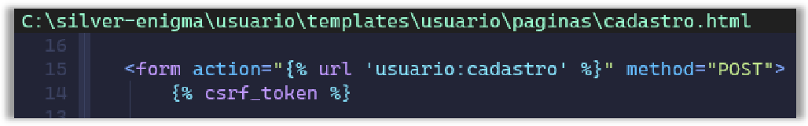
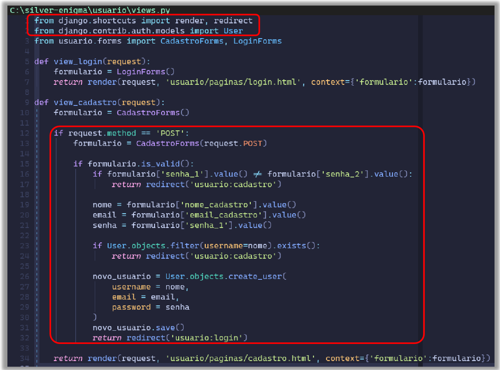
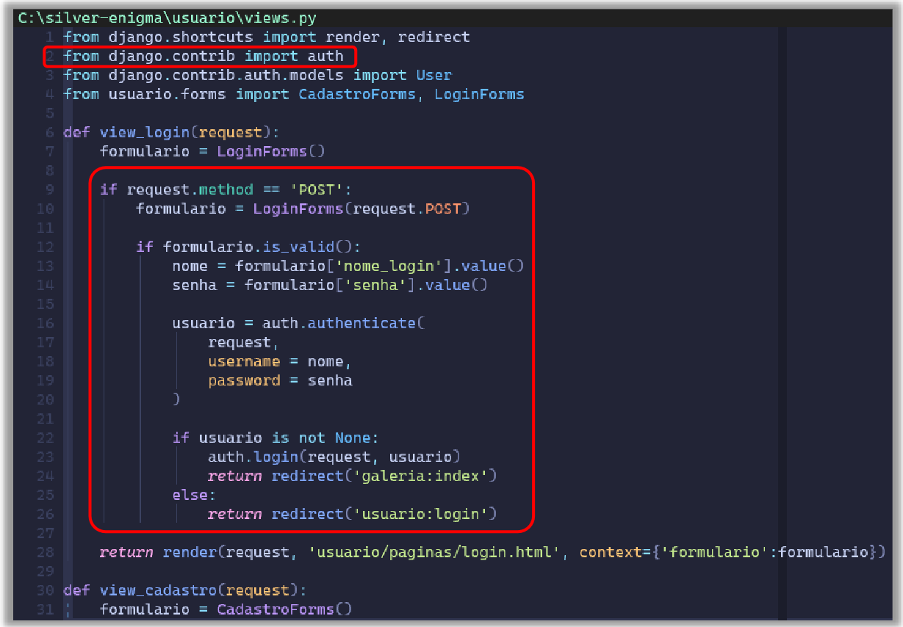
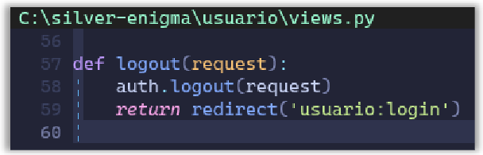
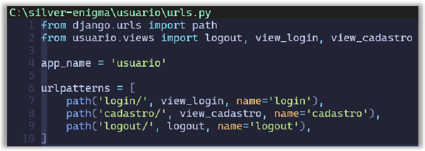
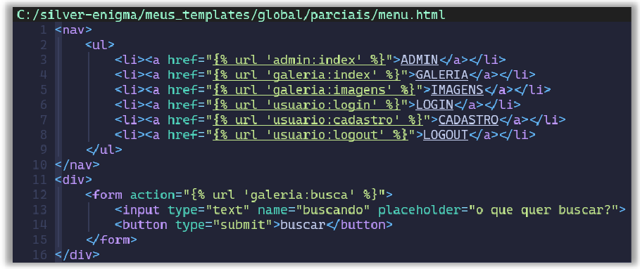
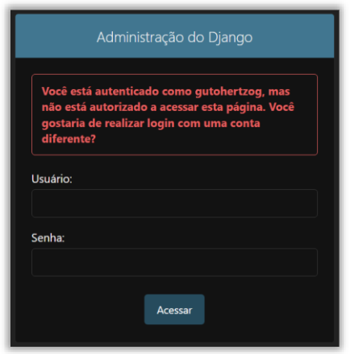
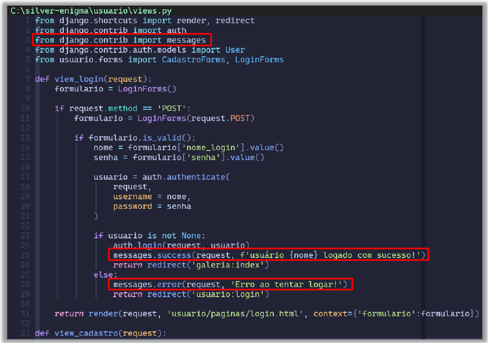
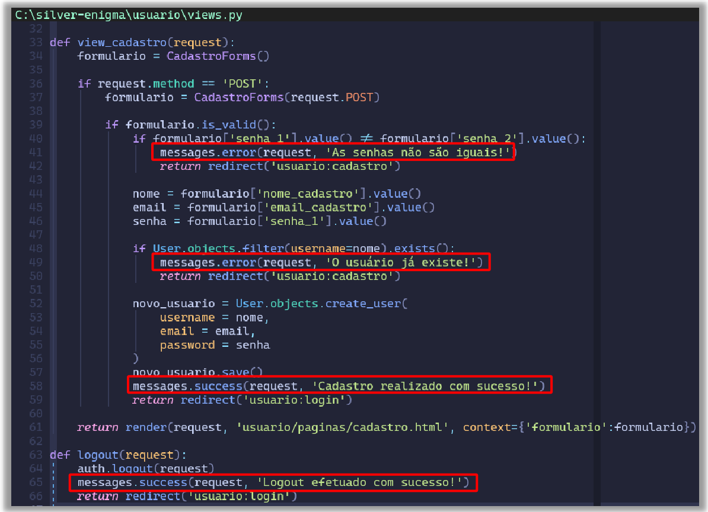
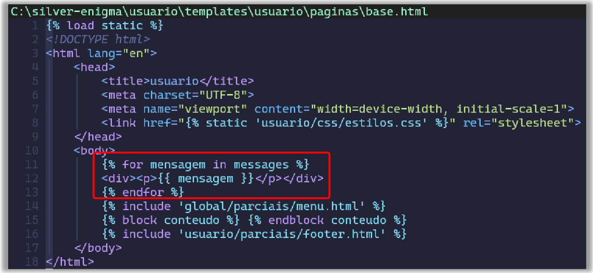

# Aula 03 #

## 1. Cross-Site Request Forgery (CSRF) ##

O [Cross-Site Request Forgery ou CSRF](https://pt.wikipedia.org/wiki/Cross-site_request_forgery) é uma vulnerabilidade na segurança da web que possibilita que alguma ameaça se passe por clientes comuns. Assim, ela pode se disfarçar como o servidor e passar informações através do método POST.

O CSRF Token consiste em uma série de caracteres aleatórios, gerados a cada formulário a ser preenchido pelo usuário que é enviado pelo servidor. Após o recebimento pelo usuário, o token é checado novamente. O servidor só aceita o POST caso o CSRF Token se provar igual ao enviado inicialmente.

Diferentemente do session token e dos cookies, o CSRF Token não pode ser utilizado por um hacker mal-intencionado. Dessa forma, a existência do CSRF Token é crucial em todo formulário da web, para que o envio de formulários não seja forjado por terceiros.

## 2. Usuário ##

### 2.1. Registro do Usuário ###
Agora que temos os formulários de login e cadastro prontos, já podemos realizar o registro do usuário junto ao banco de dados.

Até o momento, para realizarmos alguma interação com o banco de dados, temos que criar uma classe no arquivo `models.py` e realizar todo o processo já visto.

Acontece que isso não faz sentido, nesse caso. Pois, qual é a necessidade de criar uma tabela de controle de usuário se ela já existe. Se olharmos o banco de dados `db.sqlite3`, podemos ver que existe uma tabela chamada `auth_user`. Como o nome sugere, essa tabela é usada para registrar e autenticar os usuários.

    

Se observamos ela, toda a estrutura já está pronta. Então não tem o porquê de reinventar a roda. Se realizarmos uma busca na tabela, veremos o registro do nosso usuário admin lá, com a senha criptografada, é claro.

Voltando à tela de cadastro, quando usamos esse tipo de formulário, é comum usar a própria página para validar. Então, passaremos a própria página no campo action do formulário HTML.

Veja como está:

    

Partindo dessa ideia, a validação vai se dar na função que faz a requisição da página.

Veja como ela vai ficar:

    

Veja a grande atualização feita na função:
1. está sendo realizada mais duas importações novas;
    1. a primeira é a função redirect, que será usada para redirecionar para uma página específica;
    1. a segunda é a classe User, que será usada para o cadastro do novo usuário;
1. está sendo feito um teste para verificar se a requisição da página foi feita usando o método POST;
1. se for, vai receber o formulário preenchido;
1. então, é feita uma verificação se o formulário enviado está válido;
1. depois vai testar se a senha do primeiro campo está igual a senha do segundo campo;
1. se a senha for diferente, vai ser feito o redirecionamento à página cadastro.html com o formulário em branco;
1. se for a mesma, vai pegar os resultados enviados pelo formulário e salvar em variáveis;
    1. como a senha é a mesma para os campos senha_1 e senha_2, não tem diferença de qual pegar;
1. depois, é feito um teste para ver se o usuário que está se querendo criar ainda não existe na tabela (se existir, é enviado novamente para a página de cadastro.html);
1. se o usuário ainda não existir, é criado um objeto com os dados do formulário;
1. por fim, é salvo no banco de dados;
1. se verificar o banco de dados, o usuário cadastrado estará lá;

Repare que o nome dos campos retornados do formulário são os mesmos que foram usados nos atributos da classe CadastroForms.

### 2.2. Login do Usuário ###
Uma vez que o usuário se cadastra, é então encaminhado para a tela de login. Mas ainda não há qualquer lógica para realizar o login.

Veja como ficará a função:

    

Agora, veja como está funcionando:

1. primeiro está sendo feita a importação do auth;
1. depois, é feita a verificação do POST no request e se o formulário é válido;
1. após, é feita a captura dos valores do formulário;
1. usando o auth, é criado um objeto a partir da variável request e dos dados enviados pelo formulário;
1. é verificado se a chamada no auth.authenticate não gera um valor nulo;
1. depois, é chamada a função login do auth para realizar o login do usuário;
1. e retornado à página index da galeria;
1. se acontecer algum erro, é redirecionado para a página de login novamente;

### 2.3. Logout do Usuário ###

Agora que já realizamos o login, temos que ser capazes de realizar o logout também.

Para isso, vamos criar uma função em /usuario/views.py para realizar essa tarefa. Veja como ela vai ficar:

    

Repare que ela é bem simples. Como a funcionalidade será apenas o logout do usuário, não há necessidade de criar uma página dedicada a isso. Embora tenhamos que cadastras ela no arquivo /usuario/urls.py para que o link seja visível.

Veja como ficará:

    

Ali, estamos apenas criando a url para a chamada da função de logout.

Agora, por fim, tem que ainda adicionar o link no menu. Veja abaixo:

    

Veja o que acontece se tentar entrar na página administrativa quando logado:

    

## 3. Mensagens ##

Repare que temos trocentas coisas acontecendo agora com o usuário, mas nenhuma forma de notificação. Para isso, o Django tem uma biblioteca específica para ajudar.

Vamos usá-la no arquivo `/usuario/views.py`. Veja como vai ficar:

    

    

Como pode ser visto acima, é realizado a importação do messages. Através dela, são chamadas as funções success ou error de acordo com a necessidade. Veja que elas são chamadas sempre antes da função redirect e depois de ser feito algum teste, como usuário existente, senha incorreta etc.

Agora, basta atualizar os arquivos HTMLs que são usados. Veja abaixo:

    

Como todos os arquivos são herdados desses arquivos base (dos aplicativos usuario e galeria), vai ser melhor adicionar a chamada da mensagem neles (como esse arquivo está sendo usado o mesmo layout para ambos os aplicativos, ele poderia ser colocado na pasta de páginas globais e herdado por ambos os aplicativos).

## 4. Atividades ##

1. Aplique o que foi visto na aula nos seus projetos.

