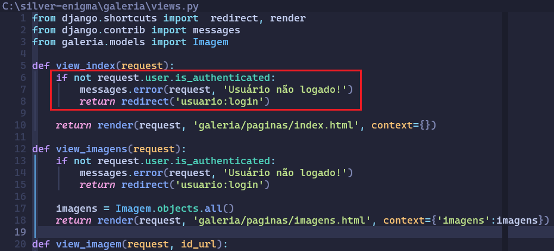
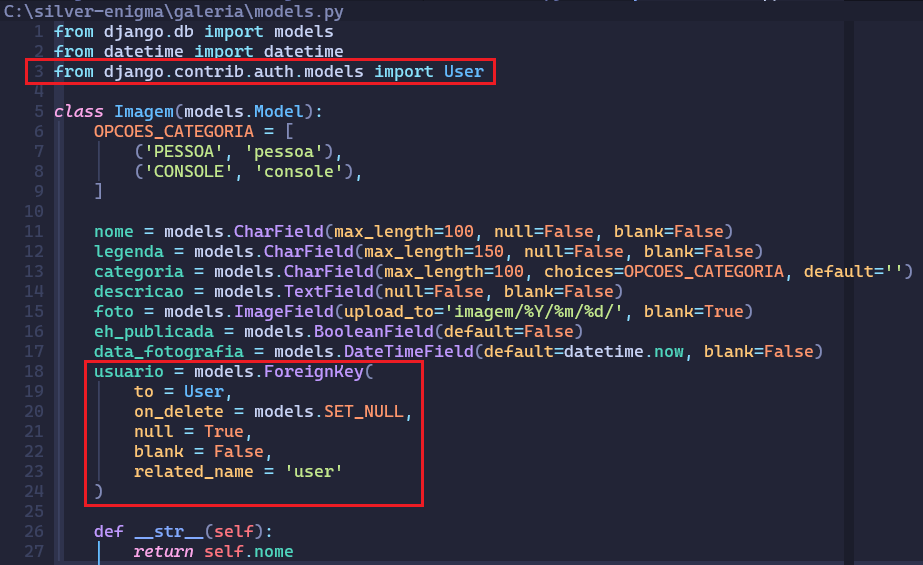
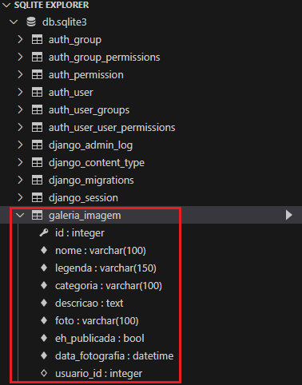
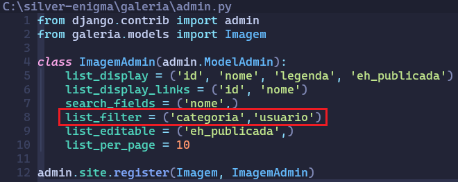
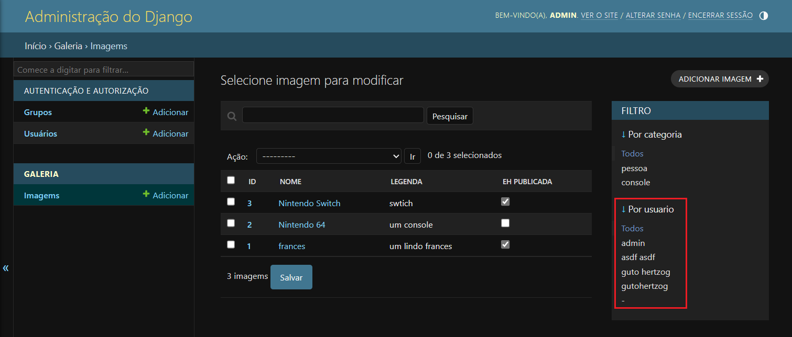
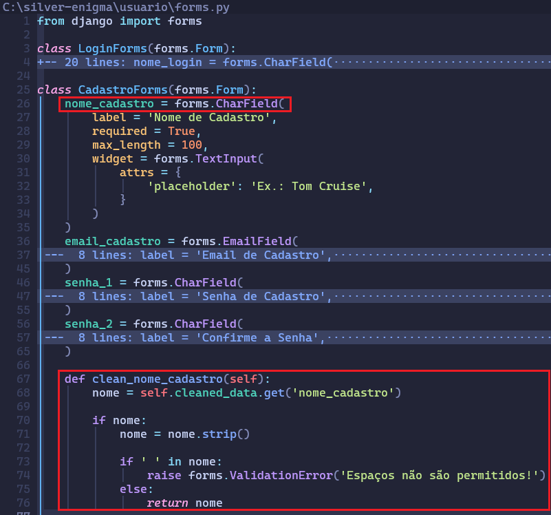
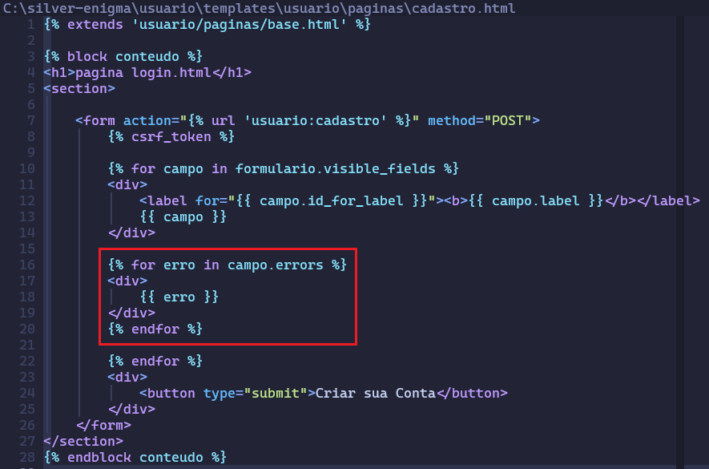
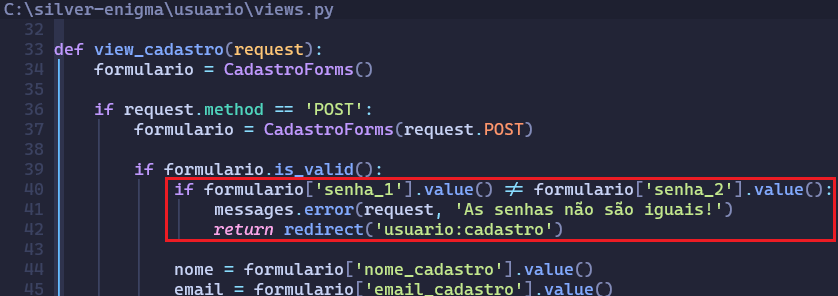
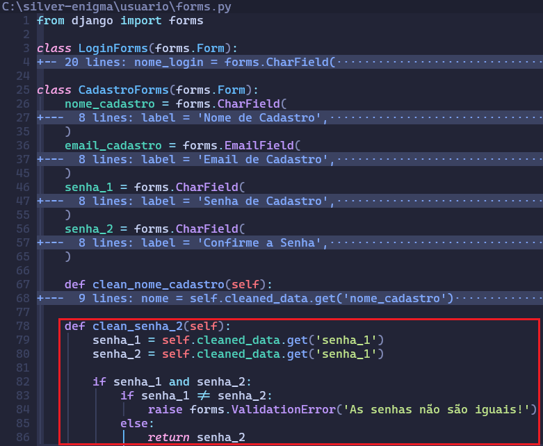
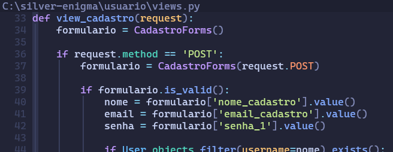

<h1 style="text-align:center;">Aula 04</h1>

<h2>1. Usuário não Logado</h2>
Agora que a aplicação está realizando o cadastro, login e logout do sistema, é possível realizar restrições de determinadas páginas, determinados aplicativos. Para esse tipo de restrição, é necessário usar uma validação do usuário autenticado.

Veja abaixo:
<p align="center">
    
</p>
<br>

Acima, há um destaque no teste de uma autenticação que está sendo realizado na página. Caso um usuário não logado tente acessar a página, ele será redirecionado para a página de login do usuário.
<br><br>

<h2>2. Imagem do Usuário</h2>
Uma vez que os usuários estão sendo cadastrados, eles precisam ser associados às imagens que eles irão realizar upload. Para isso, a classe **Imagem**, criada no arquivo **/galeria/models.py**, tem que  tem que criado uma chave estrangeira com a tabela User.

Veja como ficará a classe com a chave estrangeira:
<p align="center">
    
</p>
<br>

No código acima, está sendo feita a importação da classe **User** e depois adicionado um novo campo à classe **Imagem**. Veja os parâmetros usados:
- `to`: define a qual tabela tem que ser feita a realação;
- `on_delete`: define o que acontece com o registro na tabela **Imagem** se o usário proprietário for deletado da tabela **User**; nesse caso, todas as imagens relacionadas a ele serão removidos;
- `related_name`: define a qual campo da tabela será feita a FK;

Uma vez alterada a classe, tem que ser realizado novamente os comandos de migração.
```shell
python manage.py makemigrations
```
e
```shell
python manage.py migrate
```
Agora, o novo campo estará presente na tabela **Imagem** e, também, será uma chave estrangeira.

Veja como ficará a tabela:
<p align="center">
    
</p>
<br>

Por fim, será adicionado um novo campo no **list_filter** no arquivo **/galeria/admin.py**. Dessa forma, será possível filtrar as imagens através do usuário também.
<p align="center">
    
    <br><br>
    
</p>
<br>

<h2>3. Removendo Espaços em Branco</h2>
Na tela de cadastro do usuário, está sendo coletado o nome do usuário. Acontece que deixar o nome do usuário com espaços em branco não é uma boa prática. Para evitar isso, tem que adcionado uma função que realize essa validação.

Veja abaixo como ficará o arquivo **/usuario/forms.py**:
<p align="center">
    
</p>
<br>

Dentro da classe é criado um método que fará essa limpeza do campo **nome_cadastro**. Repare que o método começa com **clean_**. Esse nome não é aleatório. Usando **clean** juntamente com o nome do campo, faz que ele seja chamado automaticamente quando o formulário é enviado através da página web.

Se o formulário for preenchido agora e enviado com algum espaço entre as palavras no campo **Nome de Cadastro**, nada vai ser mostrado. Mesmo a função levantando uma exceção, a página ainda não foi configurada para exibir qualquer mensagem.

Então, se faz necessário adicionar uma forma de captar e exibir a mensagem de erro. Veja como ficará:
<p align="center">
    
</p>
<br>

Acima, é adicionado uma tag for do Django para que a mensagem seja exibida. Veja que a variável usada para captar o erro no for interno é a mesma criada pelo for mais externo.
<br><br>

<h2>4. Revalidando a Senha</h2>
Agora, a validação de senhas iguais está sendo feita na função **view_cadastro**, no arquivo **/usuario/views.py**. Veja abaixo o trecho:
<p align="center">
    
</p>
<br>

Mas, o ideal é que ele seja feito diretamente no formulário. Para essa alteração funcionar, ela terá que ser feita no arquivo **/usuario/forms.py**.

Veja como ficará:
<p align="center">
    
</p>
<br>

Agora a validação para senhas que não são iguais está sendo feito diretamente na classe que gerencia o formulario. Isso deixa o código muito mais otimizado.

Veja como ficará a função view_cadastro agora:
<p align="center">
    
</p>
<br><br>

- - - -
<h1 class="centro">Atividade</h1>

- Adicione o que foi aprendido em seus projetos;

