<h1 style="text-align:center;">Aula 05</h1>

## 1. Criando a Base ##
Agora que o usuário está conseguindo cadastrar e entrar na plataforma, temos que criar as formas dele ser capaz de adicionar, editar e apagar dados na galeria.

Para isso, temos que seguir os seguintes passos:
- criar os arquivos HTMLs;

    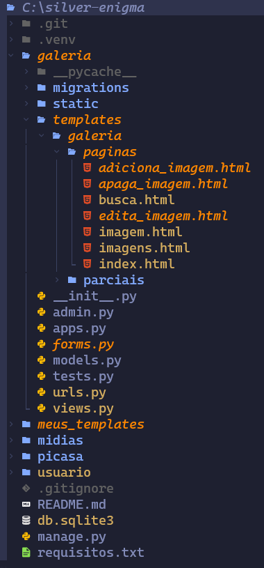

- carregá-los nas suas respectivas funções no arquivo **/galeria/views.py**;

    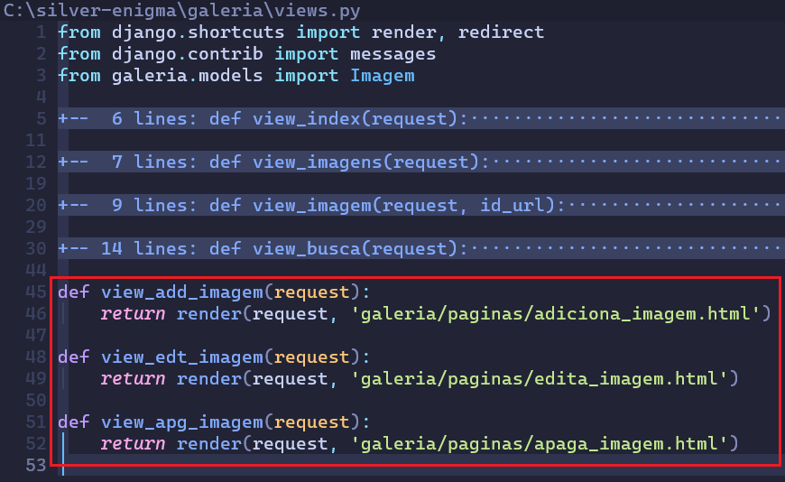

- adicionar a rota delas no arquivo **/galeria/urls.py**;

    

- adicionar no menu de navegação;

    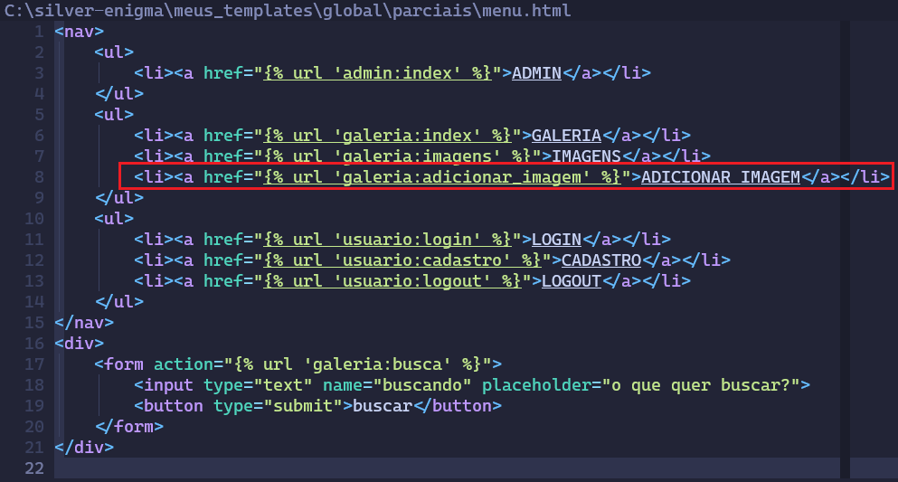

## 2. Adicionando um Registro ##
Agora que a base de tudo está criada, falta criar o arquivo **/galeria/forms.py** que vai receber esses dados do usuário.

### 2.1. Arquivo forms.py ###
Para isso, tem que se ter o cuidado para que os campos dos formuários sejam iguais. Mas isso pode ser muito trabalhoso, já que se for altar um formulário, tem que alterar os demais.

Felizmente, o Django possui uma forma muito útil de lidar com esse tipo de problema. Para isso, temos que informar qual será a referência de modelo para o novo modelo.

Veja como ficará o arquivo **/galeria/forms.py**:

    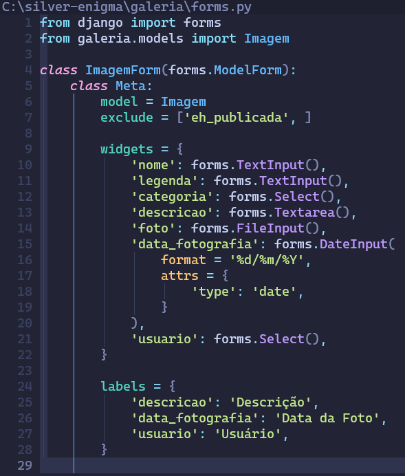

A **class Meta** usada dentro da clsse **ImagemForm** está referenciando os meta dados da própria classe (a **ImagemForm**). Dentro dela, informamos a qual modelo ela está se referindo, que será **Imagem**. Ainda dentro da classe **Meta**, há o campo **exclude**, ele indica quais campos não serão de controle do usuário, afinal, assim um administrador pode escolher se uma imagem pode ou não ser publicada.

O campo **widget** está sendo usado para definir como esses campos irão aparecer no formulário.

O campo **labels** está sendo usado para criar textos alternativos para alguns campos. Assim, eles poderão aparecer acentuados para o usuário na página HTML.

Se reparar na classe herdada, verá que ela difere da usada anteriormente no arquivo **/usuario/forms.py**:

    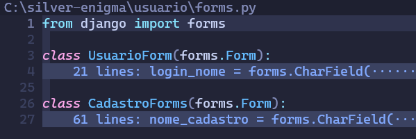

Isso porque antes o formuário estava sendo criado sem um modelo de referência. Agora, ele está sendo criado a partir de um modelo já criado.

### 2.2. Arquivo views.py ###
Ainda tem que ser feita a lógica no arquivo **/galeria/views.py** para que esses dados recebidos do formulário sejam salvos no banco de dados. Ela não vai ser muito diferente do que já foi feito no arquivo **/usuario/views.py** ao se cadastrar um usuário.

Veja como ficará:

    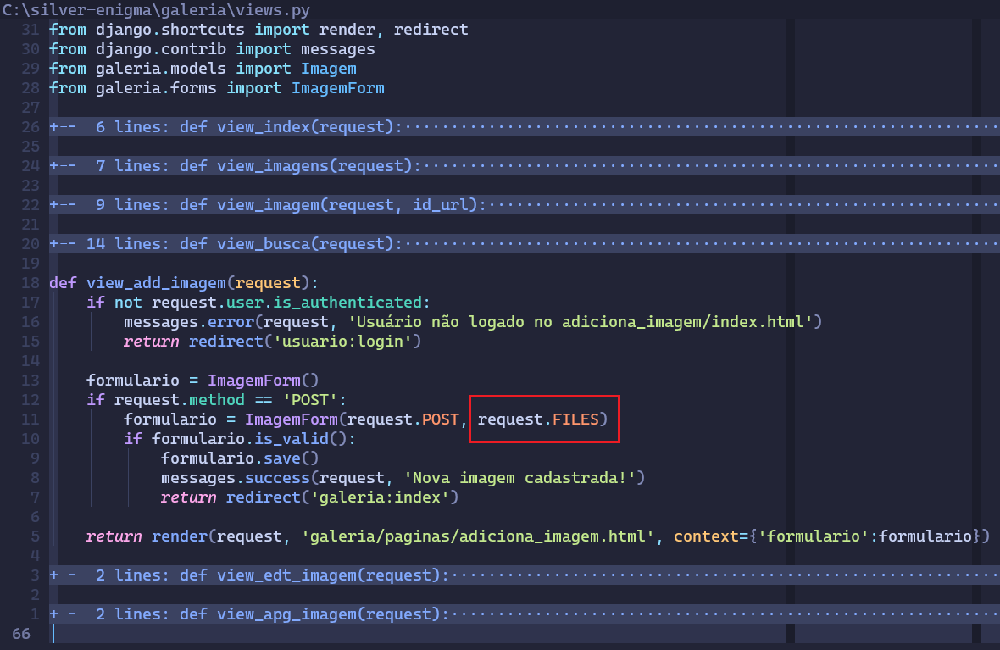

A maior diferença será junto ao comando **request.POST**, que também precisa receber um **request.FILES** para que possa receber os arquivos corretamente do formulário. Assim como o próprio formuário, que agora também precisa de um novo parâmetro para recber imagem.

    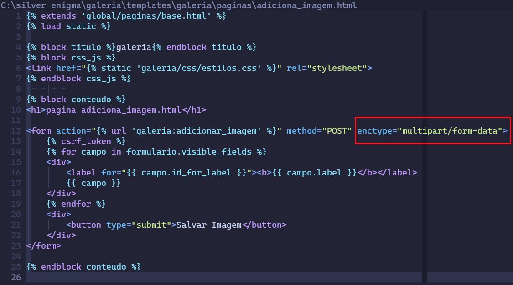

## 2. Editando um Registro ##
Uma vez que as imagens estão sendo salvas, está na hora de poder editar os dados dela.

A primeira coisa a se fazer, é criar os botões junto da imagem exibida. Esse botão está na página da própria imagem, e não da lista delas. Por isso eles não foram adicionados ao menu.

Um formulário de alteração tem como característica já vir previamente preenchido com as informações daquele item. Então, o que tem que ser feito é carregar as informações daquele objeto para então poder alterar e salvar novamente. A referência do objeto será captada através da url da própria página.

Então, para começar, veja como ficarão os botões e as urls:

    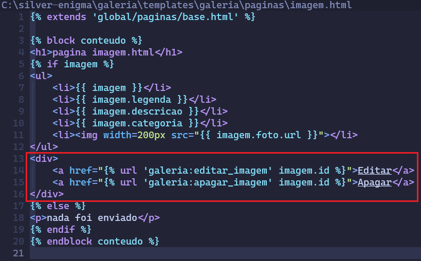

A maior diferença está na url, que está sendo enviado junto o id da imagem, para assim a página destino ser capaz de buscar o registro por aquele valor.

    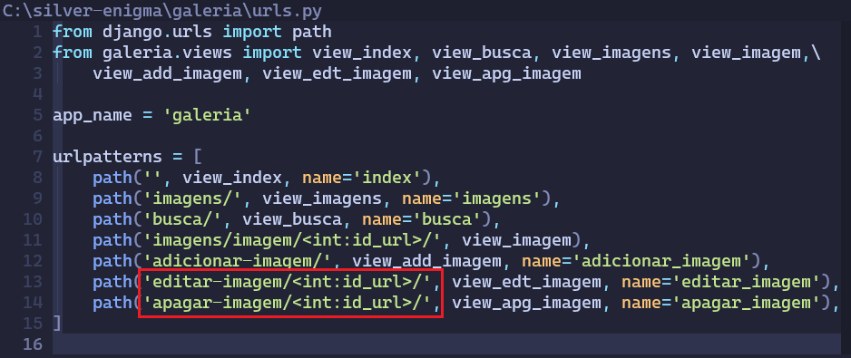

A lógica de apagar uma imagem é similar a que foi realizada até o momento. Veja como ficará:

    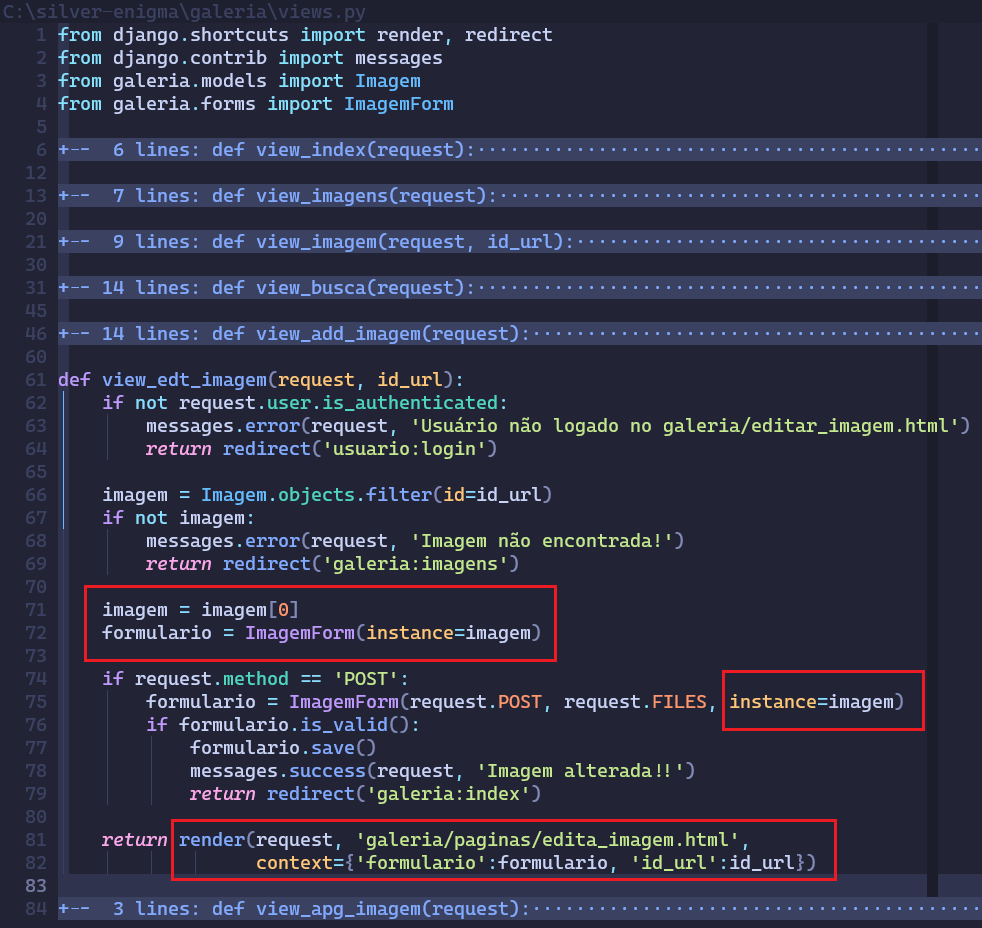

A maior diferença é que ao ser criado um formulário a partir da classe **ImagemForm**, será feito passando como referência a imagem buscada no banco de dados usando o parâmetro **instance**. Depois, na hora de realizar um render da página web, também tem que ser passado com o dicionário o id da imagem, para que assim, ao se enviar o formuário alterado, tenha-se a referência da imagem.

Veja o HTML:

    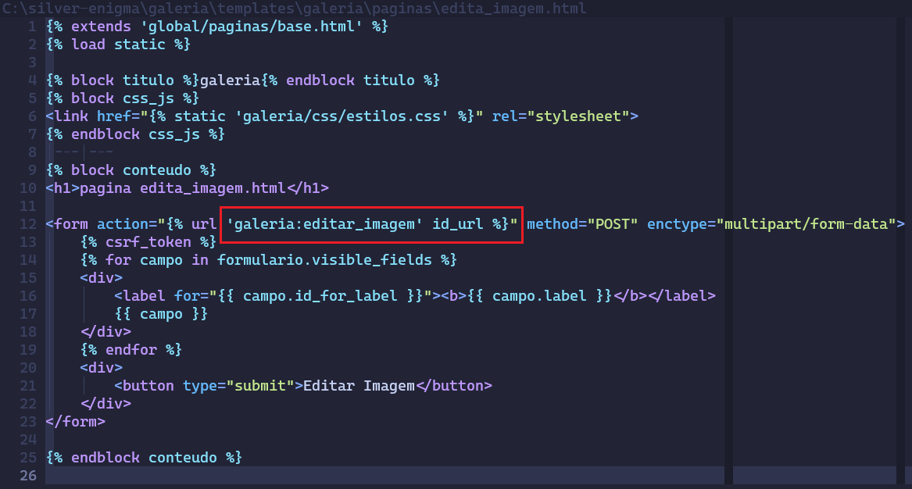

## 3. Apagando um Registro ##
Para apagar uma imagem, o processo para pegar a referência da imagem é relativamente parecido com a página de alteração e um processo bem mais simples.

Veja como ficará a função:

    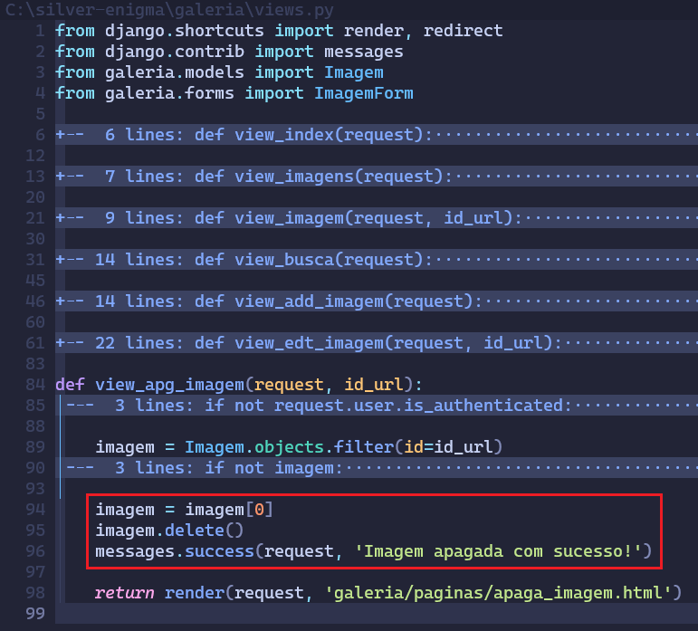

A única particularidade é a chamada do método **delete()** pelo objeto, apagando em definitivo o registro.
PS.: as verificações de login e objeto não encontrado só foram fechados, para deixar a imagem menor, mas eles ainda precisam estar lá.

